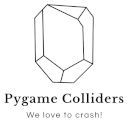

Welcome to Pygame Colliders documentation!
==========================================

Pygame Colliders is a library that makes possible to use more complex
colliders than Pygame standard ``Rect`` providers.

Even the library is called "Pygame Colliders" library is not bound to Pygame
and doesn't have Pygame as a requirement.

The implementation itself is made in plain Python and there are plans to
create more performant solution if there is a need amongst the library
users.

Initial performance tests using 60 FPS frame speed consuming roughly half
of the time in checking (~50%) allows using around 300 colliders constantly
checking for the collisions.

Installation
------------

Pygame colliders can be installed easily with pip.

.. code-block:: bash

    pip install pygame-colliders

Usage
-----

Check :ref:`Colliders` documentation for more details.

Project
-------

You can find project at GitHub https://github.com/jtiai/pygame-colliders
